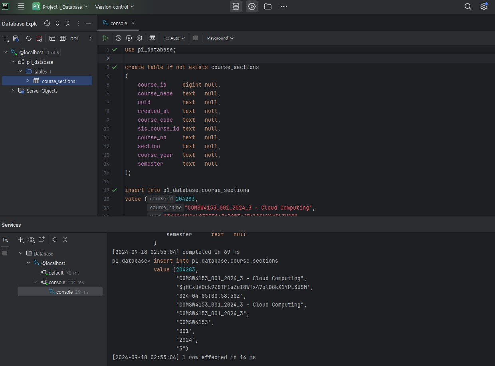

# COMS4153-P1-Database

COMSW4153 - Cloud Computing Database Repository


- Download MySQL Server 8.0.39
- Download DataGrip
- Create a data source to MySQL server.
- Create p1_database schema

- Created a row of data with the following query.  

```
use p1_database;

create table if not exists course_sections
(
    course_id     bigint null,
    course_name   text   null,
    uuid          text   null,
    created_at    text   null,
    course_code   text   null,
    sis_course_id text   null,
    course_no     text   null,
    section       text   null,
    course_year   text   null,
    semester      text   null
);

insert into p1_database.course_sections
value (204283,
       "COMSW4153_001_2024_3 - Cloud Computing",
       "3jHCxUV0ck9Z8TF1sZeI8WTx47olDGkX1YPL3USM",
       "024-04-05T00:58:50Z",
       "COMSW4153_001_2024_3 - Cloud Computing",
       "COMSW4153_001_2024_3",
       "COMSW4153",
       "001",
       "2024",
       "3")
```


```[2024-09-18 02:55:04] 1 row affected in 14 ms```

---


|  |
|:---------------------------------------------------:|
|             __DataGrip Local Setup__                |
